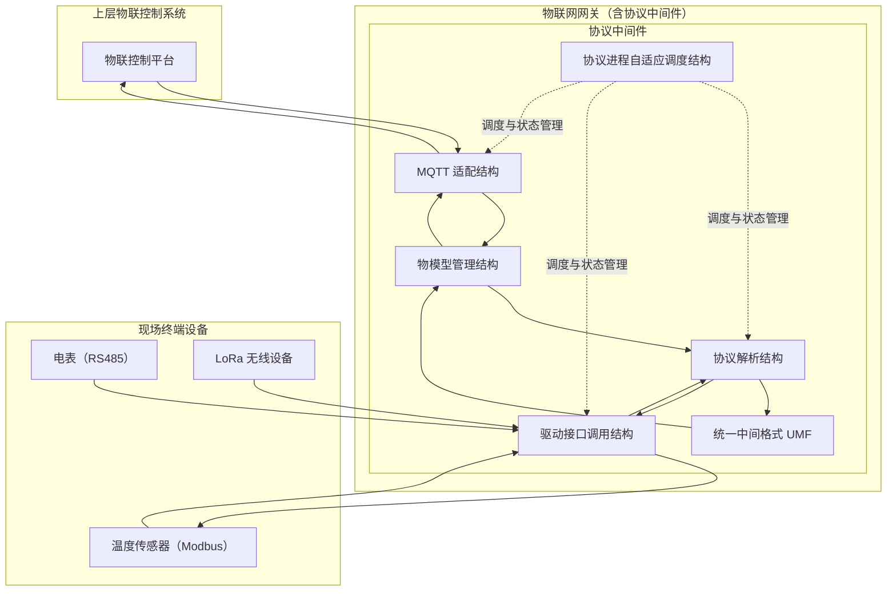

```mermaid
flowchart TD

%% ====== 上层控制系统 ======
    subgraph CLOUD[上层物联控制系统]
        CTRL[物联控制平台]
    end

%% ====== 物联网网关 ======
    subgraph GW[物联网网关（含协议中间件）]
        
        subgraph MID[协议中间件]
            PARSE[协议解析结构]
            UMF[统一中间格式 UMF]
            MODEL[物模型管理结构]
            MQTT[MQTT 适配结构]
            DIO[驱动接口调用结构]
            PROC[协议进程自适应调度结构]
        end

    end

%% ====== 现场设备 ======
    subgraph SITE[现场终端设备]
        DEV1[温度传感器（Modbus）]
        DEV2[电表（RS485）]
        DEV3[LoRa 无线设备]
    end


%% ====== 数据流（下→中→上） ======
    DEV1 --> DIO
    DEV2 --> DIO
    DEV3 --> DIO

    DIO --> PARSE
    PARSE --> UMF
    UMF --> MODEL
    MODEL --> MQTT
    MQTT --> CTRL

%% ====== 控制指令（上→中→下） ======
    CTRL --> MQTT
    MQTT --> MODEL
    MODEL --> PARSE
    PARSE --> DIO
    DIO --> DEV1

%% ====== 调度机制（虚线） ======
    PROC -. 调度与状态管理 .-> PARSE
    PROC -. 调度与状态管理 .-> DIO
    PROC -. 调度与状态管理 .-> MQTT

```