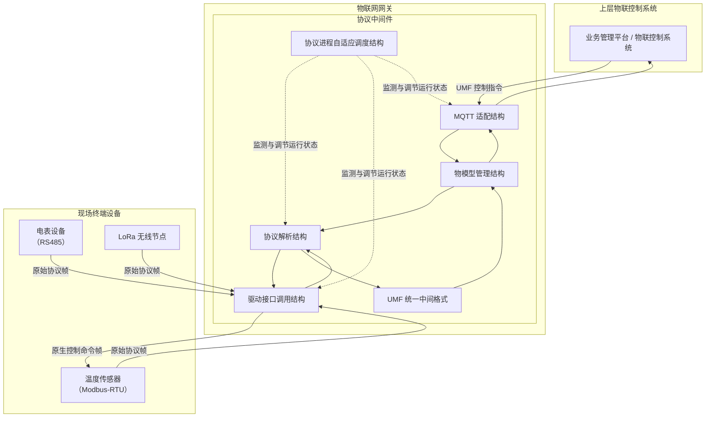

```mermaid
flowchart TD

    %% --- 上层物联控制系统 ---
    subgraph CLOUD[上层物联控制系统]
        CTRL[业务管理平台 / 物联控制系统]
    end

    %% --- 网关设备部分 ---
    subgraph GW[物联网网关]
        subgraph MID[协议中间件]
            DIO[驱动接口调用结构]
            PARSE[协议解析结构]
            UMF[UMF 统一中间格式]
            MODEL[物模型管理结构]
            MQTT[MQTT 适配结构]
            PROC[协议进程自适应调度结构]
        end
    end

    %% --- 现场设备部分 ---
    subgraph SITE[现场终端设备]
        DEV1[温度传感器\n（Modbus-RTU）]
        DEV2[电表设备\n（RS485）]
        DEV3[LoRa 无线节点]
    end

    %% --- 数据流方向：上 → 中 → 下 ---
    CTRL -->|UMF 控制指令| MQTT
    MQTT --> MODEL
    MODEL --> PARSE
    PARSE --> DIO
    DIO -->|原生控制命令帧| DEV1

    DEV1 -->|原始协议帧| DIO
    DEV2 -->|原始协议帧| DIO
    DEV3 -->|原始协议帧| DIO

    DIO --> PARSE
    PARSE --> UMF
    UMF --> MODEL
    MODEL --> MQTT
    MQTT --> CTRL

    %% --- 调度结构 ---
    PROC -.监测与调节运行状态.-> PARSE
    PROC -.监测与调节运行状态.-> DIO
    PROC -.监测与调节运行状态.-> MQTT

```