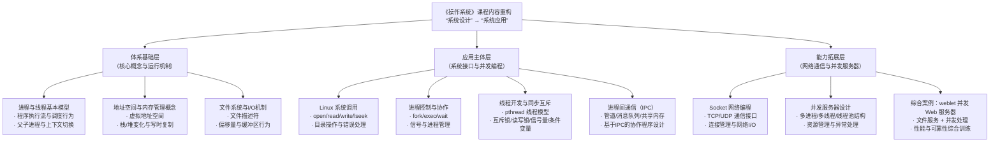

```mermaid
flowchart TD
    A[《操作系统》课程内容重构<br/>“系统设计” → “系统应用”]:::root

    A --> B[体系基础层<br/>（核心概念与运行机制）]:::level1
    A --> C[应用主体层<br/>（系统接口与并发编程）]:::level1
    A --> D[能力拓展层<br/>（网络通信与并发服务器）]:::level1

    %% 基础层
    B --> B1[进程与线程基本模型<br/>· 程序执行流与调度行为<br/>· 父子进程与上下文切换]
    B --> B2[地址空间与内存管理概念<br/>· 虚拟地址空间<br/>· 栈/堆变化与写时复制]
    B --> B3[文件系统与I/O机制<br/>· 文件描述符<br/>· 偏移量与缓冲区行为]

    %% 应用主体层
    C --> C1[Linux 系统调用<br/>· open/read/write/lseek<br/>· 目录操作与错误处理]
    C --> C2[进程控制与协作<br/>· fork/exec/wait<br/>· 信号与进程管理]
    C --> C3[线程开发与同步互斥<br/>· pthread 线程模型<br/>· 互斥锁/读写锁/信号量/条件变量]
    C --> C4[进程间通信（IPC）<br/>· 管道/消息队列/共享内存<br/>· 基于IPC的协作程序设计]

    %% 能力拓展层
    D --> D1[Socket 网络编程<br/>· TCP/UDP 通信接口<br/>· 连接管理与网络I/O]
    D --> D2[并发服务器设计<br/>· 多进程/多线程/线程池结构<br/>· 资源管理与异常处理]
    D --> D3[综合案例：weblet 并发 Web 服务器<br/>· 文件服务 + 并发处理<br/>· 性能与可靠性综合训练]


```