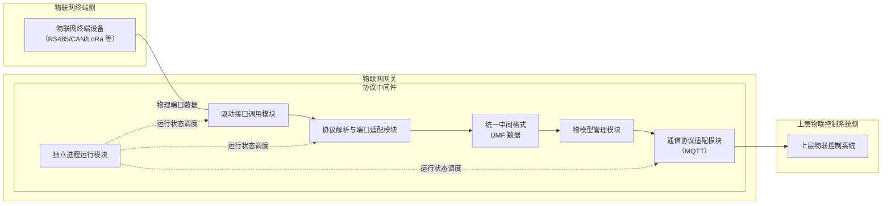

```mermaid
graph LR
    %% 方向：从左到右
    subgraph DEV_SIDE[物联网终端侧]
        DEV[物联网终端设备（RS485/CAN/LoRa 等）]
    end

    subgraph GW[物联网网关]
        subgraph MIDDLE[协议中间件]
            DIO[驱动接口调用模块]
            PARSE[协议解析与端口适配模块]
            UMF[统一中间格式\nUMF 数据]
            MODEL[物模型管理模块]
            MQTT[通信协议适配模块\n（MQTT）]
            PROC[独立进程运行模块]
        end
    end

    subgraph CLOUD[上层物联控制系统侧]
        CTRL[上层物联控制系统]
    end

    %% 连接关系
    DEV ---|物理端口数据| DIO
    DIO --> PARSE
    PARSE --> UMF
    UMF --> MODEL
    MODEL --> MQTT
    MQTT --> CTRL

    %% 运行管理
    PROC -.运行状态调度 .-> DIO
    PROC -.运行状态调度 .-> PARSE
    PROC -.运行状态调度 .-> MQTT

```